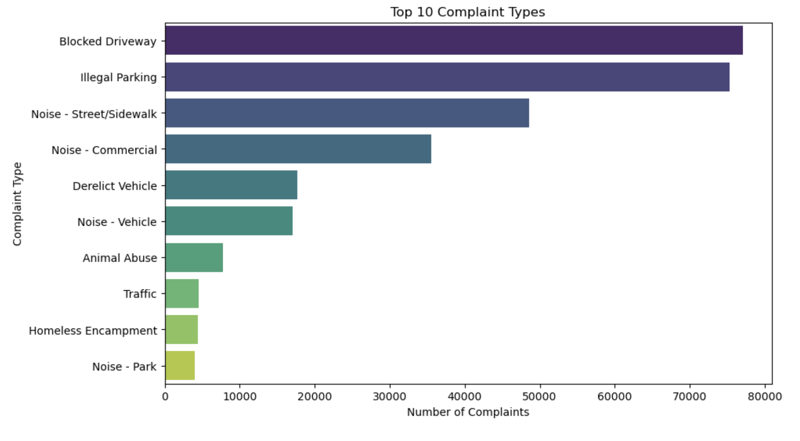
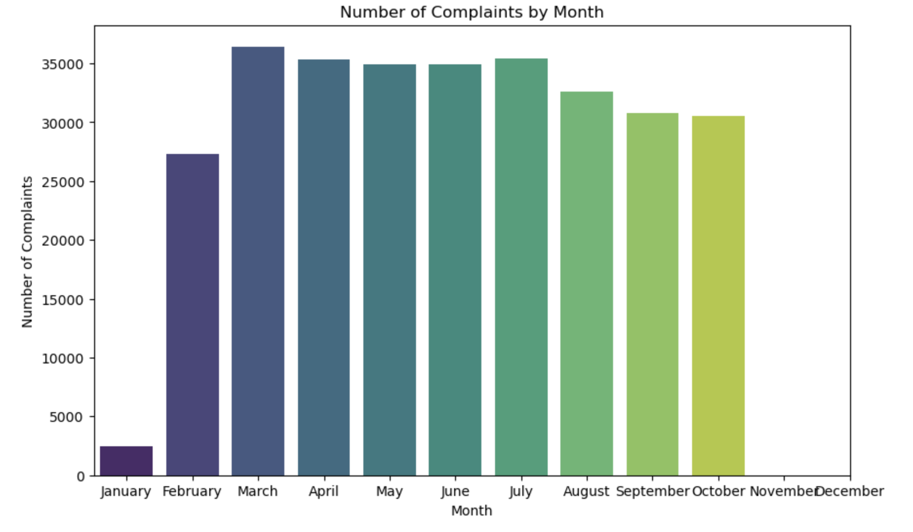
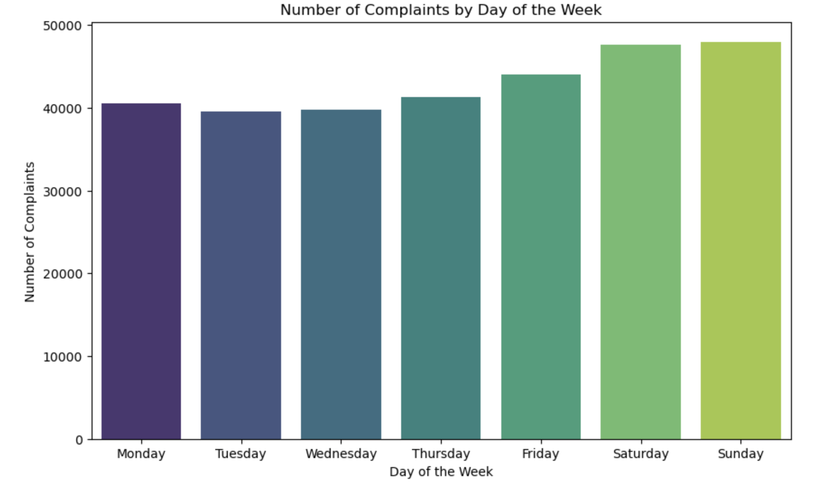
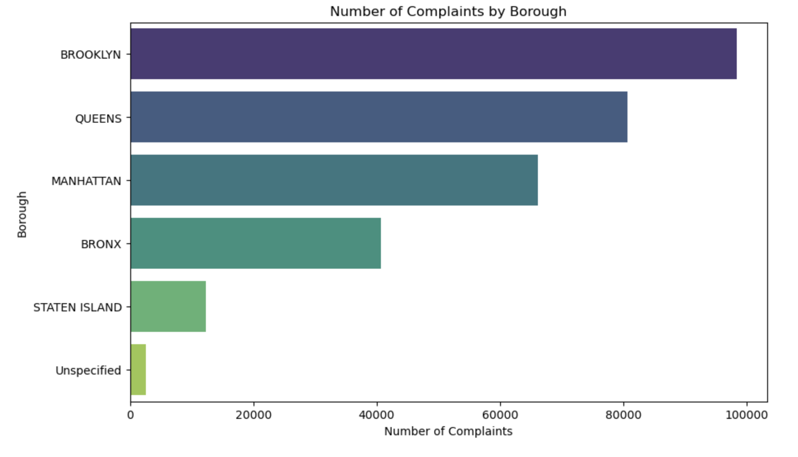
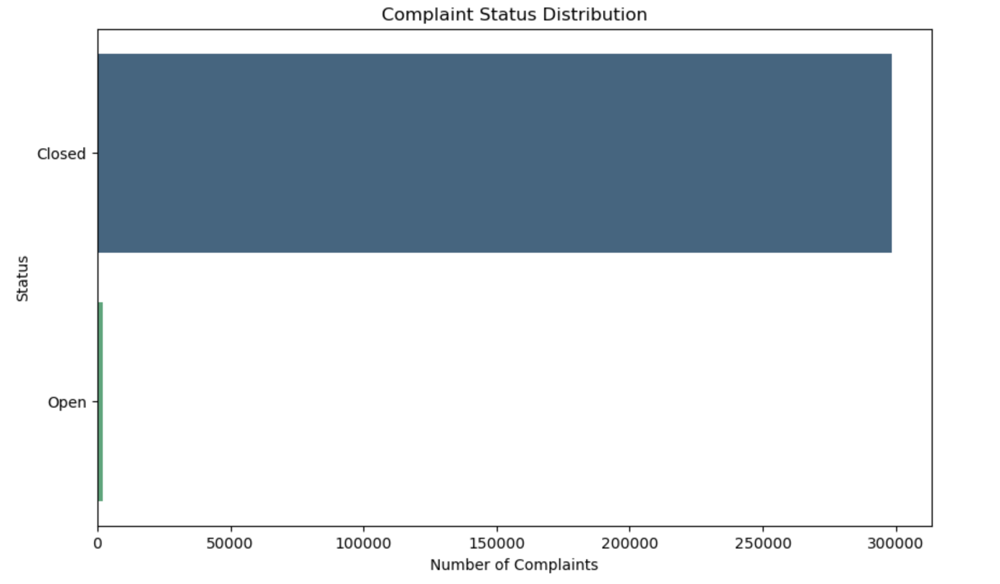
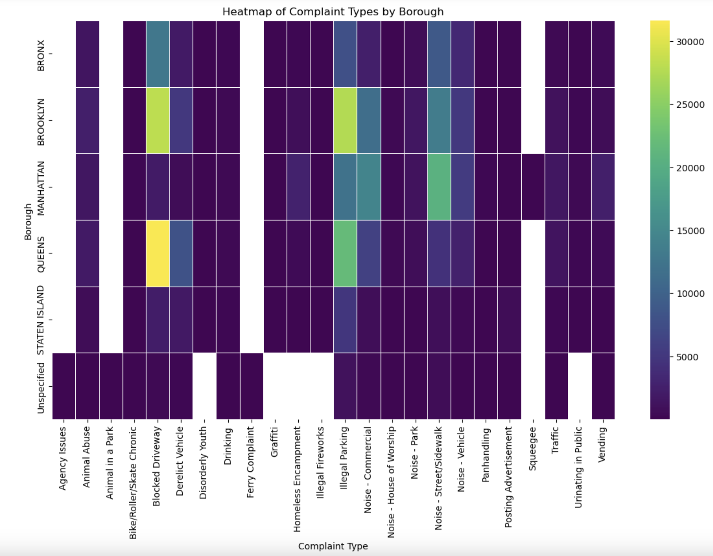
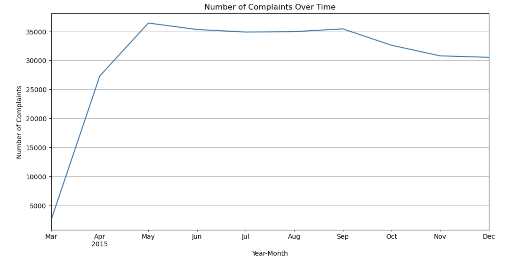

# NYC 311 Data Analysis

## Overview

This project involves analyzing the NYC 311 service request dataset to gain insights into the types of complaints reported by residents. The notebook includes data exploration, data quality planning, and visualization to understand the distribution and frequency of different complaint types.

## Table of Contents

1. [Data Quality Plan](#data-quality-plan)
2. [Distribution of Complaint Types](#distribution-of-complaint-types)
3. [Handling Outliers](#handling-outliers)
4. [Feature Normalization](#feature-normalization)
5. [Categorical Feature Engineering](#categorical-feature-engineering)
6. [Missing Values Treatment](#missing-values-treatment)
7. [Visualizations](#visualizations)

## Data Quality Plan

1. **Outliers Treatment**: Statistical methods will be applied to identify and treat outliers, such as capping, transformation, or removal after careful analysis.
2. **Feature Normalization**: Skewed features will be normalized through transformation or feature engineering. Some skewed numeric features will be converted to binary.
3. **Categorical Feature Engineering**: Continuous features with irregular cardinality will be treated as categorical if appropriate. Rare categories in high-cardinality categorical features will be combined to reduce complexity.
4. **Missing Values Treatment**: Investigate the reasons for missing values. Features with extensive missing values that are not critical will be omitted, while important features will be imputed with appropriate statistical measures.

## Handling Outliers

Outliers in the data are identified and treated using statistical methods. Various techniques such as capping, transformation, or removal are considered based on the analysis.

## Feature Normalization

Features with skewed distributions are normalized using transformations or feature engineering techniques to improve the quality of the data.

## Categorical Feature Engineering

Continuous features with irregular cardinality are treated as categorical when appropriate. High-cardinality categorical features are simplified by combining rare categories.

## Missing Values Treatment

Missing values are handled by either omitting non-critical features with extensive missing data or imputing important features using appropriate statistical measures.

## Visualizations

Various visualizations are used throughout the notebook to illustrate the distribution of complaint types and the effects of data cleaning techniques. These include bar charts, histograms, and other relevant plots.

### Top 10 Complaint Types

The bar chart below shows the distribution of the top 10 complaint types reported in the NYC 311 dataset:



### Complaints over time

The bar chart visualizes the number of complaints received each month.





### Distribution of Complaints by Borough

The bar chart visualizes the number of complaints received from different boroughs.



### Status of Complaints

The bar chart visualizes the distribution of complaints based on their status.



### Heatmap of Complaints

The included html file contains the heatmap of Complaints

[NYC 311 complaints heatmap](heatmap_complaints.html)

### Analysis of Complaint Types by Borough

The heatmap visualizes the distribution of different types of complaints across various boroughs. The intensity of the color represents the number of complaints, with darker colors indicating fewer complaints and lighter colors indicating more complaints.



### Time Series Analysis

The line graph visualizes the number of complaints received over time, specifically from March 2015 to December 2015.



## Getting Started

To get started with this analysis, you can clone the repository and run the Jupyter Notebook using the following commands:

```bash
# Clone the repository
git clone <repository-url>

# Navigate to the project directory
cd NYC-311-Data-Analysis

# Install the required dependencies
pip install -r requirements.txt

# Run the Jupyter Notebook
jupyter notebook NYC_311.ipynb
